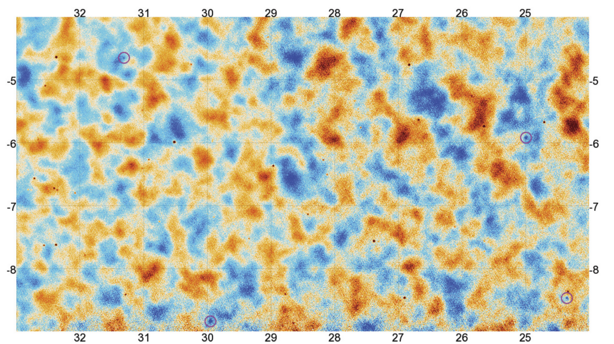

# Map Generation: Parallelizing Mapmaking in Cosmology

The goal of this project is to parallelize the generation of temperature/polarization anisotropy maps from ground-based telescopes.

Temperature anisotropies on a ~2000 pixel map from the Atacama Cosmology Telescope. Source from Fig. 14.2 of Modern Cosmology, 2nd Edition, Scott Dodelson 

## The Problem:
We must build a large map (990,000 pixels), divided into many square tiles containing Cosmic Microwave Background data (CMB), from several processes that contain only partial map knowledge.

## Method:
Convert patches of the observed sky into square tiles and send each square tile to one of many processes. Then use MPI reduction, via mpi4py - a python library, to build a large sky map that covers the observed area of the sky from the independent processes.

## (Hopeful) Results:
Unproven yet, however the aim is to generate a high resolution map of the observed CMB sky at a fraction of the time that previous CMB experiments have done. 

