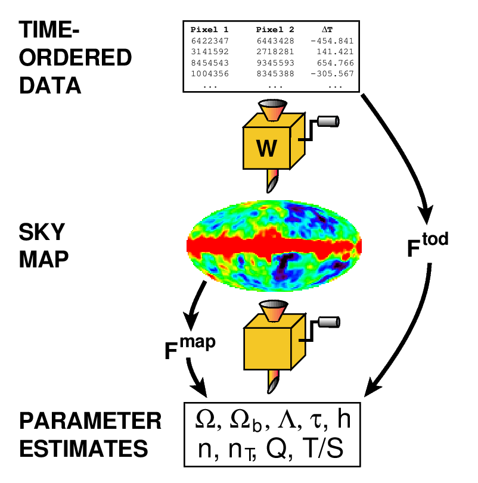
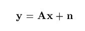

# Map Generation: Parallelizing Mapmaking in Cosmology

The goal of this project is to parallelize the generation of temperature/polarization anisotropy maps from time-ordered data (TOD) gathered by ground-based telescopes.

Temperature anisotropies on a ~2000 pixel map from the Atacama Cosmology Telescope. Source from Fig. 14.2 of Modern Cosmology, 2nd Edition, Scott Dodelson 

Building maps from TOD allows us to analyze the CMB sky and constrain cosmological parameters that describe our universe. Maps are advantangeous to use over the raw time-ordered data namely because map data is orders of magnitude smaller that TOD. 

Motivation for building maps from TOD data, and the overview of where the map making algorithm lies in the process of analyzing data. F_TOD is a function mapping from the time-ordered data to parameter estimates, F_map is a function mapping data from the CMB map to parameter estimates. Source from Figure 1 of How to Make Maps from CMB Data Without Losing Information, Max Tegmark 

## The Problem:
We must build a large map (990,000 pixels), divided into many square tiles containing Cosmic Microwave Background data (CMB), from several processes that contain only partial map knowledge. The problem boils down to parallelizing data reduction - the difficulty is that processes have patches of sky *randomly* assigned to them. So there is an associatied time cost in finding which processes send what data to other processes. 

We are currently also investigating whether optimizing latency or throughput provides the fastest map construction. Analysis to follow experiments. 

## Method:
Convert patches of the observed sky into square tiles and send each square tile to one of many processes. Then use MPI reduction, via mpi4py - a python library, to build a large sky map that covers the observed area of the sky from the independent processes.

An example data reduction method is fairly simple, assuming the time-ordered data depends linearly on the map. 

y is an n-dimensional vector corresponding to the TOD, x is a m-dimensional vector corresponding to the map, A is a known nxm matrix, and n is an n-dimensional noise vector. Source from Eq 1 of How to Make Maps from CMB Data Without Losing Information, Max Tegmark 

We therefore hand patches of data to processes that also own said patch, then sum the received patch of data with the currently owned patch, and pass the newly summed data to the next process. Continue until all patches have their data fully summed by all contributing processes. 

## Progress
We have two algorithms developed for the reduction of data. One method sends few messages between nodes, but each message is very large in size. The other algorithm sends many messages, but each message is very small in size. We are in the process of testing efficiency and scalability of each algorithm. 

## (Hopeful) Results:
Unproven yet, however the aim is to generate a high resolution map of the observed CMB sky at a fraction of the time that previous CMB experiments have done. 

